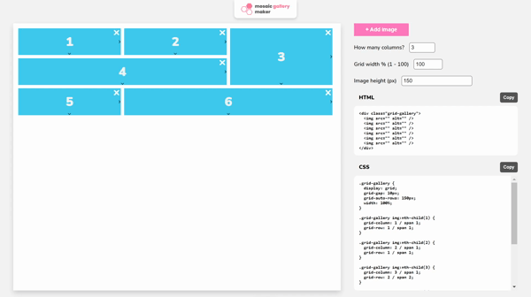

# Mosaic Gallery Maker

An easy-to-use drag and drop tool for designing interesting mosaic galleries for the web.
The app generates HTML and CSS of the image gallery the user designed.
The app is hosted on GitHub pages here: [Mosaic Gallery Maker](https://dashnothing.github.io/mosaic-gallery-maker/)

---

## Installation

Clone the project from `https://github.com/DashNothing/sliding-puzzle.git`

## Usage

Run `npm start` to run the application locally.

---

## Features

- Drag and drop UI for moving and resizing images
- Easily add and remove images from the gallery
- Adjustable column count, gallery width and image height
- View and copy generated HTML and CSS
